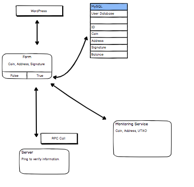

# BeamForm

## Instructions 
 - Fork and clone
 - 'cd beam-form'
 - 'yarn install'
 - 'yarn start'

## Goal

Automate the current process for Beam where a user uploads their information, and change the current data path. 

## Stack

- React 
- mySQL
- WordPress

## Data Workflow 

 

## Documentation around API Calls and Database Structure

